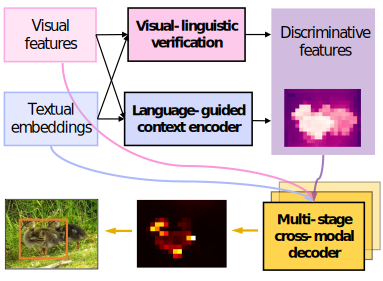
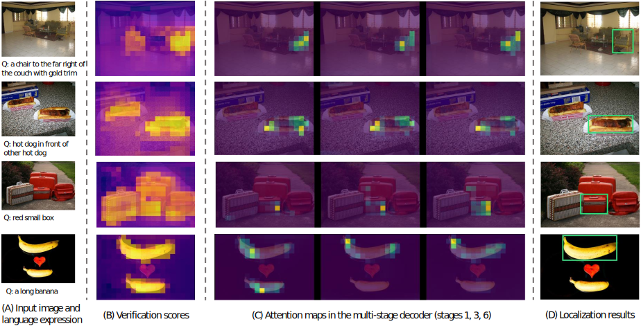

# VLTVG-PyTorch with DDP, Horovod, and DeepSpeed

This repository contains the PyTorch implementations using Distributed Data Parallel (DDP), Horovod, and DeepSpeed for [Improving Visual Grounding with Visual-Linguistic Verification and Iterative Reasoning](https://arxiv.org/abs/2205.00272). These implementations are intended for usage with the [ALCF](https://alcf.anl.gov). Follow the instructions below to get started.

## Common Setup

### 1. Dataset Preparation
Prepare the datasets as instructed in the [VLTVG repository](https://github.com/yangli18/VLTVG).

### 2. Conda Environment Setup
Load the Conda environment using the following commands:
```bash
# For PyTorch and Horovod
module load conda 
conda activate

# For DeepSpeed
module load conda/2023-01-10-unstable
conda activate
```

### 3. Python Virtual Environment Setup
#### First Time Setup:
Create and activate the Python virtual environment, and install required packages:
```bash
# Create Python virtual environment
python -m venv --system-site-packages vltvg
source vltvg/bin/activate

# Install required packages
pip install -r requirements.txt
```
#### Activations:
Activate the virtual environment using:
```bash
source vltvg/bin/activate
```

## Running with Different Implementations
### PyTorch DDP
```bash
aprun -n 8 -N 4 python train_ddp.py --config configs/VLTVG_R101_referit_ddp.py --checkpoint_latest --checkpoint_best
```

### Horovod
```bash
aprun -n 8 -N 4 python train_hvd.py --config configs/VLTVG_R101_referit_ddp.py --checkpoint_latest --checkpoint_best
```

### DeepSpeed
```bash
mpiexec --verbose \
  --envall -n 8 \
  --ppn 4 \
  --hostfile "${PBS_NODEFILE}" python train_ds.py \
  --config configs/VLTVG_R101_referit_ddp.py --polaris_nodes 2 \
  --checkpoint_latest --checkpoint_best \
  --deepspeed_config scripts/deepspeed/ds_config.json
```

## Additional Information

For additional examples, refer to the [scripts](scripts/) folder. Update directories and configurations accordingly for your specific setup.

## Below is [VLTVG](https://github.com/yangli18/VLTVG)'s original README:
---
Improving Visual Grounding with Visual-Linguistic Verification and Iterative Reasoning
========
This is the official implementation of [Improving Visual Grounding with Visual-Linguistic Verification and Iterative Reasoning](https://arxiv.org/abs/2205.00272).
*IEEE/CVF Conference on Computer Vision and Pattern Recognition (CVPR), 2022.*

## Introduction
Our proposed framework for visual grounding. With the features from the two modalities as input, the visual-linguistic verification module and language-guided context encoder establish discriminative features for the referred object. Then, the multi-stage cross-modal decoder iteratively mulls over all the visual and linguistic features to identify and localize the object.

<p align="center">
  
</p>


## Visualization
For different input images and texts, we visualize the verification scores, the iterative attention maps of the multi-stage decoder, and the final localization results.

<p align="center">
  
</p>


## Model Zoo

The models are available in [Google Drive](https://drive.google.com/drive/folders/1fZsUYV3T2ltw_sLBTXFMmFNIyIKOCM2I?usp=sharing).

<table style="width:90%; text-align:center">
<thead>
  <tr>
    <th></th>
    <th colspan="3">RefCOCO</th>
    <th colspan="3">RefCOCO+ </th>
    <th colspan="3">RefCOCOg </th>
    <th>ReferItGame</th>
    <th>Flickr30k</th>
  </tr>
</thead>
<tbody>
  <tr>
    <td></td>
    <td>val</td>
    <td>testA</td>
    <td>testB</td>
    <td>val</td>
    <td>testA</td>
    <td>testB</td>
    <td>val-g</td>
    <td>val-u</td>
    <td>test-u</td>
    <td>test</td>
    <td>test</td>
  </tr>
  <tr>
    <td>R50</td>
    <td>84.53</td>
    <td>87.69</td>
    <td>79.22</td>
    <td>73.60</td>
    <td>78.37</td>
    <td>64.53</td>
    <td>72.53</td>
    <td>74.90</td>
    <td>73.88</td>
    <td>71.60</td>
    <td>79.18</td>
  </tr>
  <tr>
    <td>R101</td>
    <td>84.77</td>
    <td>87.24</td>
    <td>80.49</td>
    <td>74.19</td>
    <td>78.93</td>
    <td>65.17</td>
    <td>72.98</td>
    <td>76.04</td>
    <td>74.18</td>
    <td>71.98</td>
    <td>79.84</td>
  </tr>
</tbody>
</table>


## Installation
1. Clone the repository.
    ```bash
    git clone https://github.com/yangli18/VLTVG
    ```

2. Install PyTorch 1.5+ and torchvision 0.6+.
    ```bash
    conda install -c pytorch pytorch torchvision
    ```

3. Install the other dependencies.
    ```bash
    pip install -r requirements.txt
    ```


## Preparation
Please refer to [get_started.md](docs/get_started.md) for the preparation of the datasets and pretrained checkpoints.


## Training

The following is an example of model training on the RefCOCOg dataset.
```
python -m torch.distributed.launch --nproc_per_node=4 --use_env train.py --config configs/VLTVG_R50_gref.py
```
We train the model on 4 GPUs with a total batch size of 64 for 90 epochs. 
The model and training hyper-parameters are defined in the configuration file ``VLTVG_R50_gref.py``. 
We prepare the configuration files for different datasets in the ``configs/`` folder. 


## Evaluation
Run the following script to evaluate the trained model with a single GPU.
```
python test.py --config configs/VLTVG_R50_gref.py --checkpoint VLTVG_R50_gref.pth --batch_size_test 16 --test_split val
```
Or evaluate the trained model with 4 GPUs:
```
python -m torch.distributed.launch --nproc_per_node=4 --use_env test.py --config configs/VLTVG_R50_gref.py --checkpoint VLTVG_R50_gref.pth --batch_size_test 16 --test_split val
```


## Citation
If you find our code useful, please cite our paper. 
```
@inproceedings{yang2022vgvl,
  title={Improving Visual Grounding with Visual-Linguistic Verification and Iterative Reasoning},
  author={Yang, Li and Xu, Yan and Yuan, Chunfeng and Liu, Wei and Li, Bing and Hu, Weiming},
  booktitle={Proceedings of the IEEE/CVF Conference on Computer Vision and Pattern Recognition},
  year={2022}
}
```


## Acknowledgement
Part of our code is based on the previous works [DETR](https://github.com/facebookresearch/detr) and [ReSC](https://github.com/zyang-ur/ReSC).